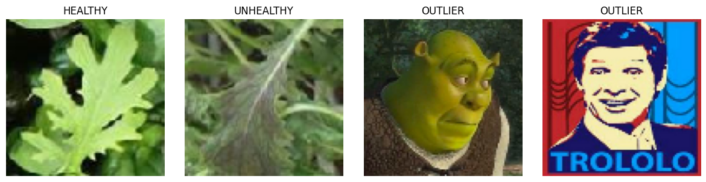

# Artificial Neural Networks and Deep Learning

## Challenge: Image Classification

	

This challenge's goal was to train a classifier to correctly predict whether an image represented a **healthy** or **unhealthy** plant.

We examined three distinct approaches to address the task at hand:

1. Custom CNNs
2. Utilizing Transfer Learning and Fine-Tuning with pre-trained models sourced from the [Keras Applications](https://keras.io/api/applications/) on the ImageNet dataset.
3. Implementing Self-Supervised Learning techniques models.

After thorough evaluation, the combination of **Transfer Learning + Fine-Tuning** emerged as the most effective strategy for solving this challenge.

## Data Analysis and Augmentation

The original dataset contained 196 outliers, which we identified and removed to ensure the quality of our training data. Following data preprocessing, data augmentation played a pivotal role in enhancing the robustness of our models. We utilized a variety of augmentation techniques sourced from KerasCV's official APIs, including:

- Random Flips
- Random Translations
- Random Rotations
- Random Zoom
- Random Brightness
- Random Crop
- CutMix/Mixup
- GaussianNoise
- RandAugment

After careful consideration of the nature of the task and validation through cross-validation, we selected augmentation transformations that do not compromise the model's ability to identify unhealthy patterns. Therefore, transformations involving cropping, cutting, and mixing were discarded from our augmentation pipeline. We focused on augmentation techniques that enhance the robustness of the model without altering the fundamental characteristics of the data.

## More Information

For a detailed overview of the challenge, methods, and models built, please refer to the [report](Report_Challenge_1.pdf) and the [notebooks](/Notebooks).

### Results

Our team attained an 0.88 accuracy on the private test set, placing us in the top 10% among 580+ participants. Leveraging fine-tuned Keras' [ConvNextLarge](https://keras.io/api/applications/convnext/#convnextlarge-function) model, our approach showcases the efficacy of pre-trained models in image classification.

## Team
* [Jacopo Piazzalunga](https://github.com/Jacopopiazza)
* [Davide Salonico](https://github.com/DavideSalonico)
* [Gabriele Puglisi](https://github.com/GabP404)
* [Denis Sanduleanu](https://github.com/DenSandu)

